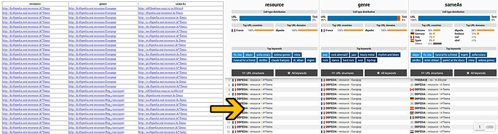

# 📊 SPARQL response visualisation

This project is a data visualisation class project targetting developers working with the **semantic web**.
It is our attempt to visualise **results of SPARQL queries** (_e.g._ from [dpbedia](https://dbpedia.org/sparql)), which usually come in the form of long tables containing **lots of URIs** (though we actually focus on URLs, not all kinds of URIs).

**[Try it on sample data online!](https://daru13.github.io/semantic-web-visualisation/demo/)** 

## Interface design

The interface we propose contains two complementary parts:

- Per-column **dashboards** containing basics statistics (_e.g_ the most common URL domains), keywords, and visualisations of the structures of the URLs (using a [Sankey diagram](https://en.wikipedia.org/wiki/Sankey_diagram)). They allow to quickly read some common metrics and get the gist of each column.
- A **data table** containing the entire result of the SPARQL query. It is split into lazyily generated pages (for better performances and ease-of-use) and offer enhanced representations of the URLs.

## Technical details

### Project organisation

The project is written in **TypeScript** (transpiled into plain JS for the browser) plus some HTML and CSS.
It has **no runtime dependency** (in particular, DOM manipulation is done using vanilla JS).

We use [Rollup](https://rollupjs.org/guide/en/) to bundle the transpiled TypeScript files into a single JS file.

### Build instructions

We use [`yarn`](http://yarnpkg.com) to manage the development dependencies and to run scripts, but it should work fine using your favourite package manager for JavaScript (such as `npm`).

Run the following commands to create your own build:
- `yarn` will install the development dependencies.
- `yarn build` will compile and bundle TypeScript sources into the `build` folder.

Note that the HTML and the CSS files of the demo pages are not processed by Rollup (they are located in the `demo` directory).
You can also run `yarn watch` to start Rollup in watch mode (_i.e._ automatically recompile the sources when they change).